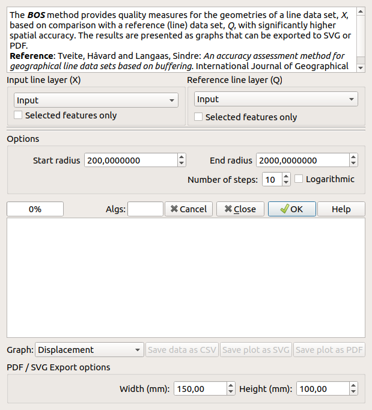
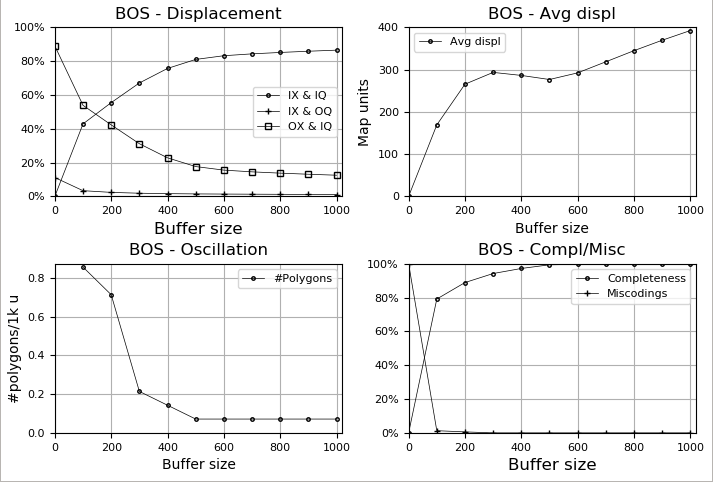
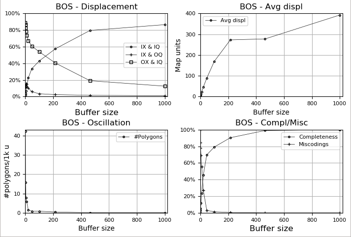

.. BOS documentation master file, created by
   sphinx-quickstart on Sun Feb 12 17:11:03 2012.
   You can adapt this file completely to your liking, but it should at least
   contain the root `toctree` directive.

The BOS Plugin - Implementing the BOS Method for Line Quality Assessment
========================================================================

Contents:

.. toctree::
   :maxdepth: 2

Indices and tables
==================

* :ref:`genindex`
* :ref:`modindex`
* :ref:`search`

Assessing line quality using the BOS method
===========================================

The BOS Plugin compares the geometries of two line layers (the input
layer *X* and the reference layer *Q*) by buffering and overlay for
several buffer sizes, collecting statistics and plotting the results
for a visual assessment of the quality (geometric accuracy, bias,
completeness and miscodings) of the input line data set with respect
to the reference line data set according to the BOS method
[Tveite1999]_.

The Buffer-Overlay-Statistics (BOS) method
------------------------------------------

The Buffer-Overlay-Statistics (BOS) method works on line data sets
and produces graphs that indicate spatial accuracy, bias,
completeness and miscodings for a line data set of unknown quality
with respect to a data set of better quality.

The core of the method is buffering around the lines of the two data
sets using a number of buffer sizes, and combining the resulting
buffer data sets (*XB* and *QB*) and the two input line data sets
(*X* and *Q*) in various ways to produce statistics that can be
plotted to reveal the characteristics of the input line data set,
*X*, with respect to the reference data set, *Q*.

The basic elements of the BOS method are illustrated below.

+--------------------------+-----------------------------+
| The elements of the BOS method                         |
+==========================+=============================+
| Line data sets (X and Q) | Buffer (XB, QB) combination |
+--------------------------+-----------------------------+
| |elements1|              | |elements2|                 |
+--------------------------+-----------------------------+

  .. |elements1| image:: illustrations/explain1.png
   :height: 200
   :align: middle

  .. |elements2| image:: illustrations/explain2.png
   :height: 200
   :align: middle

For each of the chosen buffer sizes, buffers are created and combined
using an overlay operation to produce the polygon layer illustrated
in the right part of the above illustration.

Output
------
Four types of graphs are produced, and the type of graph to be shown
is selected using the `Graph` combo box / menu.
The following graphs are offered:

- *Displacement* - Shows normalised (0%-100%) relative area sums for the
  polygons in the combined buffer data set, grouped according to the
  following combinations *Inside X and Inside Q*, *Inside X and Outside Q*,
  *Outside X and Inside Q*.

  |displacement|

  .. |displacement| image:: illustrations/displacement.png
   :align: middle

- *Average displacement* - shows the average displacement as a function of
  buffer radius.  Is expected to flatten out when the average displacement
  is equal to the spatial accuracy.

  |avgdisp|

  .. |avgdisp| image:: illustrations/averagedisplacement.png
   :align: middle

- *Oscillations* - can indicate bias and spatial accuracy.
  If the graph is not steadily decreasing, it can be taken as an
  indication of bias.

  |oscillations|

  .. |oscillations| image:: illustrations/oscillations.png
   :align: middle

- *Completeness / Miscodings* - shows completeness and miscodings (two
  graphs in the same plot) as a function of buffer radius.

  |completeness|

  .. |completeness| image:: illustrations/completeness.png
   :align: middle

In addition a combination of all the graphs is offered with the
"Combined" option.

  |combined|

  .. |combined| image:: illustrations/combined.png
   :align: middle

Options
-------

The behaviour of the BOS plugin is configured in the GUI:

|bosgui|

For input layers, you can choose if *Selected features only*
are to be considered.

In the *Options* area you will find the following:

- The *Number of steps* (buffer sizes)

- The *Start radius* (for the buffers)

- The *End radius* (for the buffers)

- It is possible to choose a *Logarithmic* distribution
  of the buffer sizes. The default is to distribute them
  evenly between the *Start radius* and *End radius*.
  

If you would like to have 10 buffers with a spacing of 100, you
could specify 100 for the *Start radius*, 1000 for the *End radius*
and 10 for the *Number of steps*, resulting in the following buffer
sizes::

  100, 200, 300, 400, 500, 600, 700, 800, 900, 1000

With *Start radius* 1, *End radius* 1000, 10 buffers and
*Logaritmic* the list will be::

  1, 2.15, 4.6, 10, 21.5, 46.4, 100, 215.4, 464.2, 1000

Depending on your datasets, it may be useful to start with a
small radius, for instance a *Start radius* of 1 with an *End
radius* of 1000.
The steps will then not be at "nice" numbers, but the first data
point will be close to the start of the x (buffer size) axis.
The *Logaritmic* option is useful in combination with a small
start radius, in order to get more details in what is normally
the most "interesting" range.

The plots in the figure below show the effect of the
*Logarithmic* option (*Number of steps*: `10`; *Start radius*:
`10` for linear and `1` for *Logarithmic*; *End radius*: `100`).

+-------------------+-------------------+
| Linear            | Logarithmic       |
+===================+===================+
| |linear_combined| | |log_combined|    |
+-------------------+-------------------+

Output options
..............

When the algorithm has run, you can choose the type of graph
(see descriptions above).
Choices are:

* *Displacement*
* *Average displacement*
* *Oscillations*
* *Completeness*
* *Combined* - all the four graphs listed above are combined
  into one plot

Export
------

Export is supported for plots and data.

Exporting plots as PDF and SVG
...............................
Export of plots is supported with the buttons
*Save plot as SVG* and *Save plot as PDF*.

Options:

- *Width (mm)* - The width of the output graphics in mm.
  Default: 150.0 mm

- *Height (mm)* - The height of the output graphics in mm.
  Default: 100.0 mm

Exporting the data as CSV
.........................
The statistics data can be exported to CSV for further processing or
tailored visualisation.
The first (header) row contains identifiers / names for the columns.
The exported CSV consists of nine columns, and as many rows as there
are steps (plus the header row).
The CSV-file looks like this (five steps in this example)::

    radius;IR;I;R;O;completeness;miscodings;average_displacement;oscillations
    200.0;28500509.552210856;91345651.61111134;113376990.93457934;6068139105.312706;0.19671702510313907;0.7601548286200464;594.4025546563738;0.1974226191819506
    400.0;106114289.65340048;134189530.21981135;173808986.21196535;5890899886.840816;0.3941682281114015;0.5284117923479394;908.9111184324876;0.11376896698620881
    600.0;207985731.5163426;153389969.1893688;208527378.02795056;5740443047.301017;0.5479680819839098;0.3559997748555806;1087.6903083504928;0.06692292175659341
    800.0;320066918.213234;162997040.60599986;231709138.4748819;5602226235.222582;0.6662973341813202;0.23494762857415086;1205.5310091551798;0.06023062958093407
    1000.0;438372775.45679665;166790573.15283233;247128084.98095602;5472587533.011159;0.7345931607936302;0.17208001554203864;1282.9193606248948;0.04349989914178572

A CSVT file (with the same prefix as the CSV file, but a ``csvt``
suffix) specifying the data types of the columns is also created,
with the following content::

    "String", "Real", "Real", "Real", "Real", "Real", "Real", "Real", "Real", "Real", "Real"
    
Warning
-------
The method involves a lot of computation and will therefore take a very
long time for data sets that are not extremely small.
The running time will increase with the number of steps.

Implementation
--------------
The heavy work is performed in the background using a worker thread.
Most of the computation is performed in the worker thread using QGIS
processing algorithms (*Buffer*, *Union*, *Clip*, *Difference*,
*Multipart to singleparts* and *Statistics by categories*).

The main (left) progress bar is updated each time a main step (buffer
size) has been completed, and the second (right) progress bar reports
the progress of the individual processing algorithms (there are
eight substeps for each buffer size). The current algorithm/substep
is indicated in the area between the progress bars: "prep",
"inpb (1/8)", "refb (2/8)", "clip (3/8)", "diff (4/8)",
"union1 (5/8)", "union2 (6/8)", "tosingle (7/8)" and "stat (8/8)".

Versions
--------
The current version is 1.0.1.

- 1.0.1
    - Eliminated the superfluous "BOS" submenu under the Vector menu
    - Documentation update
    - Code cleaning (PEP 8)
- 1.0: First official version.

Citation
--------
Would you like to cite / reference this plugin?

Tveite, H. (2020). The QGIS BOS Plugin.
<URL: http://plugins.qgis.org/plugins/BOS/>.

Bibtex:

.. code-block:: latex

  @misc{tveitebos,
    author = {Håvard Tveite},
    title = {The {QGIS} {BOS} Plugin},
    howpublished = {\url{http://plugins.qgis.org/plugins/BOS/}},
    year = {2020}
  }

.. rubric:: References

.. [Tveite1999] Tveite, H. and Langaas S., 1999.
   An accuracy assessment method for geographical line data sets
   based on buffering.  *International Journal of Geographical
   Information Science*, 13, pp. 27-47.
